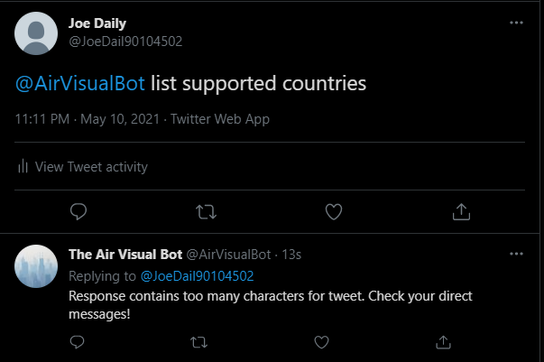

# Sarnaik_Kunaal_DS3002_DataProject2

*Author*: Kunaal Sarnaik (kss7yy@virginia.edu)<br/>
*Course*: DS 3002 - Data Science Systems (Spring 2021)<br/>
*Date*: May 10th, 2021<br/>
*Professor*: Neal Magee, Ph.D.<br/>
*Project Name*: Air Visual API Twitter Bot<br/>
*Assignment*: DS 3002 Data Project #2<br/>

Welcome to my DS3002: Data Science Systems Data Project #2 repository!

This repository contains the necessary files to write a Dockerized Python3 application that can be run to successfully execute the Twitter API, reading and writing information from the remote, publicly-accessible AirVisual API (https://www.iqair.com/us/air-pollution-data-api). Essentially, the applications creates a Twitter Bot that automatically replies to mentions querying global air quality or weather information via tweets or direct messages (depending on the number of characters present in the response). I created this containerized application to run on an Amazon AWS EC2 Instance, such that responding to mentions is automatic and continuous.

The Twitter Bot (@AirVisualBot; https://twitter.com/AirVisualBot) responds to mentions from Twitter users querying information about the air quality (i.e., pollution) or weather (e.g., temperature, air pressure, humidity, or wind information) in a certain city. The city can be queried using supported cities, states, and countries, or it can be queried using GPS coordinates (latitude and longitude). Using the query as provided by the Bot's mentions on its Twitter feed, the code then retrieves according data from the AirVisual API in order to respond via direct message or tweet reply. It does this using a conditional if-elif-else statement in Python, leveraging the Tweepy Python library that runs in harmony with the Twitter Developer API. Finally, if the user requests help via an according query, enters in a unsupported command, or has their query result in a bad HTTP request to the API, the Bot responds with an informative help message and links to this ReadMe file to aid the user in reconstructing the query.

Please enjoy this project!

- Github Repository: https://github.com/kss7yy/Sarnaik_Kunaal_DS3002_DataProject2
- Docker Container: https://hub.docker.com/r/kss7yy/sarnaik_airvisual_api_twitter_bot
- Twitter Account: https://twitter.com/AirVisualBot
- AirVisual API: https://www.iqair.com/us/air-pollution-data-api

## Twitter Usability

This section outlines a list of supported commands for the Twitter Bot. The usability that is shown in the succeeding sub-sections is what a Twitter user would Tweet in order for the Bot to respond with according information!

### Function 1: List of Supported Countries

This function allows the user to query the bot for a list of supported countries that the API has air quality and weather information for. The usability of this function is as follows:

```
@AirVisualBot list supported countries
```

From there, the Bot retrieves the supported countries in the AirVisual API using an according GET request to the following endpoint: http://api.airvisual.com/v2/countries?key={{YOUR_API_KEY}}



In this case, the response of the request contained too many characters to be tweeted, so the user received a direct message of the supported countries from the Bot.

