# Sarnaik_Kunaal_DS3002_DataProject2

*Author*: Kunaal Sarnaik (kss7yy@virginia.edu)<br/>
*Course*: DS 3002 - Data Science Systems (Spring 2021)<br/>
*Date*: May 10th, 2021<br/>
*Professor*: Neal Magee, Ph.D.<br/>
*Project Name*: Air Visual API Twitter Bot<br/>
*Assignment*: DS 3002 Data Project #2<br/>

Welcome to my DS3002: Data Science Systems Data Project #2 repository!

This repository contains the necessary files to write a Dockerized Python3 application that can be run to successfully execute the Twitter API, reading and writing information from the remote, publicly-accessible AirVisual API (https://www.iqair.com/us/air-pollution-data-api). Essentially, the applications creates a Twitter Bot that automatically replies to mentions querying global air quality or weather information via tweets or direct messages (depending on the number of characters present in the response). I created this containerized application to run on an Amazon AWS EC2 Instance, such that responding to mentions is automatic and continuous.

The Twitter Bot (@AirVisualBot; https://twitter.com/AirVisualBot) responds to mentions from Twitter users querying information about the air quality (i.e., pollution) or weather (e.g., temperature, air pressure, humidity, or wind information) in a certain city. The city can be queried using supported cities, states, and countries, or it can be queried using GPS coordinates (latitude and longitude). Using the query as provided by the Bot's mentions on its Twitter feed, the code then retrieves according data from the AirVisual API in order to respond via direct message or tweet reply. It does this using a conditional if-elif-else statement in Python, leveraging the Tweepy Python library that runs in harmony with the Twitter Developer API. Finally, if the user requests help via an according query, enters in a unsupported command, or has their query result in a bad HTTP request to the API, the Bot responds with an informative help message and links to this README.md file to aid the user in reconstructing the query.

Please enjoy this project!

- Github Repository: https://github.com/kss7yy/Sarnaik_Kunaal_DS3002_DataProject2
- Docker Container: https://hub.docker.com/r/kss7yy/sarnaik_airvisual_api_twitter_bot
- Twitter Account: https://twitter.com/AirVisualBot
- AirVisual API: https://www.iqair.com/us/air-pollution-data-api

## Table of Contents

- [Twitter Usability](#twitter-usability)
- [Error Handling in Twitter](#error-handling-in-twitter)
- [Cloning Usability](#cloning-usability)
- [Overview of Files and General Documentation](#overview-of-files-and-general-documentation)
- [End Notes](#end-notes)

## Twitter Usability

**DISCLAIMER #1**: When using this application, ensure that your Twitter profile is able to receive direct messages from anyone. Otherwise, some of the functionality will not be able to work, and the script will have to be manually restarted in AWS. You can do this by going to "Settings and Privacy", clicking "Privacy and Safety", and toggling the switch next to "allow anyone to send you Direct Messages."

This section outlines a list of supported commands for the Twitter Bot. The usability that is shown in the succeeding sub-sections is what a Twitter user would Tweet in order for the Bot to respond with according information!

**DISCLAIMER #2**: When using latitude and longitude GPS coordinates, please ensure that the latitude is limited to between -90 and 90 (inclusive), and longitude is limited to between -180 and 180. 

**DISCLAIMER #3**: Only use supported cities, states, and countries, as specified by Functions 1-3 below. For example, the bot does not recognize "United States of America" due to character constrains in Twitter, but it does recognize "USA" as a country (as seen below).

Outline of supported functions by the Twitter Bot:

- [Function 0: HELP!!!](#function-0-help)
- [Function 1: List of Supported Countries](#function-1-list-of-supported-countries)
- [Function 2: List of Supported States in a Country](#function-2-list-of-supported-states-in-a-country)
- [Function 3: List of Supported Cities in a State and Country](#function-3-list-of-supported-cities-in-a-state-and-country)
- [Function 4: Weather Summary with GPS Coordinates](#function-4-weather-summary-with-gps-coordinates)
- [Function 5: Pollution Summary with GPS Coordinates](#function-5-pollution-summary-with-gps-coordinates)
- [Function 6: Weather Summary with Specified Location](#function-6-weather-summary-with-specified-location)
- [Function 7: Pollution Summary with Specified Location](#function-7-pollution-summary-with-specified-location)
- [Function 8: Temperature with GPS Coordinates](#function-8-temperature-with-gps-coordinates)
- [Function 9: Temperature with Specified Location](#function-9-temperature-with-specified-location)
- [Function 10: Air Pressure with GPS Coordinates](#function-10-air-pressure-with-gps-coordinates)
- [Function 11: Air Pressure with Specified Location](#function-11-air-pressure-with-specified-location)
- [Function 12: Humidity with GPS Coordinates](#function-12-humidity-with-gps-coordinates)
- [Function 13: Humidity with Specified Location](#function-13-humidity-with-specified-location)
- [Function 14: Wind Information with GPS Coordinates](#function-14-wind-information-with-gps-coordinates)
- [Function 15: WInd Information with Specified Location](#function-15-wind-information-with-specified-location)

### Function 0: Help

This is a "help" or "support" function that provides the user with helpful information regarding the usability of the application. The usability of this function is as follows (very simple!):

```
@AirVisualBot help
```

From there, the bot simply returns an informative message with a link to this README.md file and GitHub repo for further information:

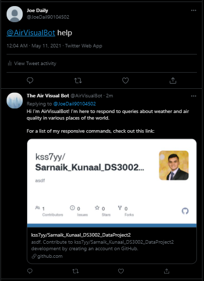

### Function 1: List of Supported Countries

This function allows the user to query the bot for a list of supported countries that the API has air quality and weather information for. The usability of this function is as follows:

```
@AirVisualBot list supported countries
```

From there, the Bot retrieves the supported countries in the AirVisual API using an according GET request to the following endpoint: http://api.airvisual.com/v2/countries?key={{YOUR_API_KEY}}. Here is an example of this request in action:


In this case, the response of the request contained too many characters to be tweeted, so the user received a direct message of the supported countries from the Bot:

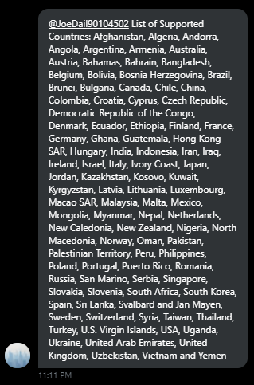

### Function 2: List of Supported States in a Country

This function allows the user to query the bot for a list of supported states in a country that the API has air quality and weather information for. The usability of this function is as follows:

```
@AirVisualBot list supported states in {{enter-country-name}}
```

From there, the Bot retrieves the supported states in the specified country from the AirVisual API using an according GET request to the following endpoint: http://api.airvisual.com/v2/states?country={{COUNTRY_NAME}}&key={{YOUR_API_KEY}}. Here is an example of this request in action for the states of USA:

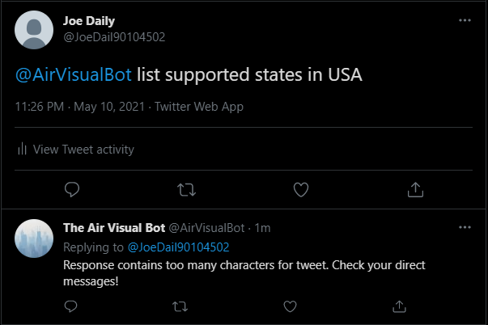

Similarly, the list of states surpassed the Twitter tweet character limit. Here is the direct message that the user received from the Bot:

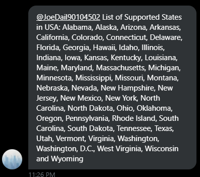

### Function 3: List of Supported Cities in a State and Country

This function allows the user to query the bot for a list of supported cities in a supported state and country that the API has air quality and weather information for. The usability of this function is as follows:

```
@AirVisualBot list supported cities in {{enter-state-name}}, {{enter-country-name}}
```

From there, the Bot retrieves the supported cities in the specified state and country from the AirVisual API using an according GET request to the following endpoint: http://api.airvisual.com/v2/cities?state={{STATE_NAME}}&country={{COUNTRY_NAME}}&key={{YOUR_API_KEY}}. Here is an example of this request in action for the cities of California, USA:

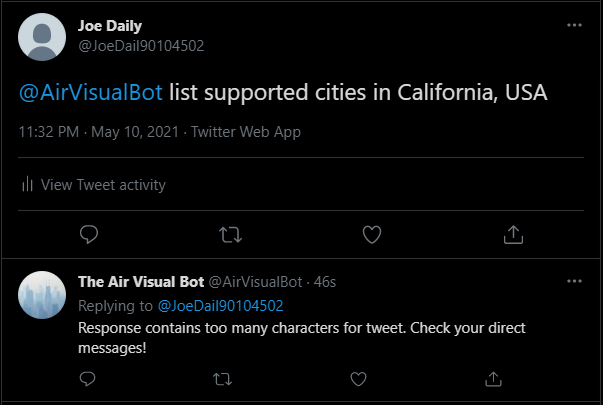

Again, the list of countries in California surpassed the Twitter tweet character limit. Here is the direct message that the user received from the Bot:

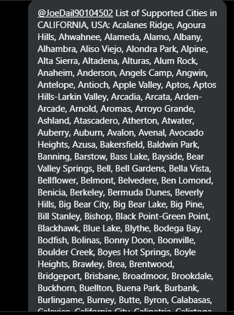

### Function 4: Weather Summary with GPS Coordinates

 This function allows the user to query a current weather summary (temperature, air pressure, humidity, and wind information) pertaining to a city that is supported and nearest the latitude and longitude GPS coordinates specified. The usability of this function is as follows:

 ```
 @AirVisualBot weather summary of lat <<enter-lat-here>> and long <<enter-long-here>>
 ``` 

Please note that the latitude must be specified between -90 and 90 (inclusively), and the longitude must be specified between -180 and 180 (inclusively). From there, the Bot retrieves the weather information in the city nearest to those coordinates from the AirVisual API using an according GET request to the following endpoint: http://api.airvisual.com/v2/nearest_city?lat={{LATITUDE}}&lon={{LONGITUDE}}&key={{YOUR_API_KEY}}. Here is an example of this request in action for the longitude and latitude nearest to Lost Creek, Texas in the United States of America:

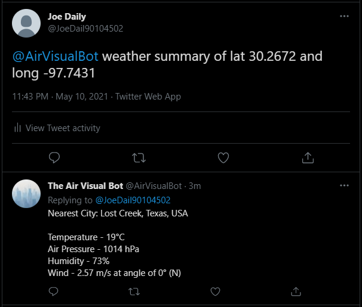

### Function 5: Pollution Summary with GPS Coordinates

 This function allows the user to query a current pollution summary pertaining to a city that is supported and nearest the latitude and longitude GPS coordinates specified. The maximally concentrated pollutant (e.g., pm2.5, pm10, ozone, nitrogen dioxide, sulfur dioxide, and carbon monoxide) is retrieved as determined by the USA Air Quality Rating. Then, a personalized message based on the rating of that pollutant is also retrieved. The usability of this function is as follows:

 ```
 @AirVisualBot pollution summary of lat <<enter-lat-here>> and long <<enter-long-here>>
 ``` 

Please note that the latitude must be specified between -90 and 90 (inclusively), and the longitude must be specified between -180 and 180 (inclusively). From there, the Bot retrieves the pollution information in the city nearest to those coordinates from the AirVisual API using an according GET request to the following endpoint: http://api.airvisual.com/v2/nearest_city?lat={{LATITUDE}}&lon={{LONGITUDE}}&key={{YOUR_API_KEY}}. Here is an example of this request in action for the longitude and latitude nearest to Lost Creek, Texas in the United States of America:

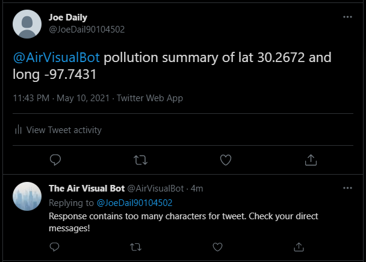

Similar to the first three functions, the user received a direct message since the character limit for twitter was exceeded in the response:

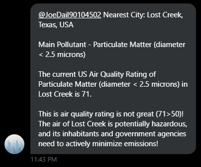

### Function 6: Weather Summary with Specified Location

This function allows the user to query a current weather summary (temperature, air pressure, humidity, and wind information) pertaining to a specified city, state, and country. Note that the supported cities, states, and countries can be found using the first three functions above. The usability of this function is as follows:

 ```
 @AirVisualBot weather summary of <<enter-city-here>>, <<enter-state-here>> in country <<enter-country-here>>
 ``` 

From there, the Bot retrieves the weather information in that specified city from the AirVisual API using an according GET request to the following endpoint: http://api.airvisual.com/v2/city?city={{CITY}}&state={{STATE}}&{{COUNTRY}}=USA&key={{YOUR_API_KEY}}. Here is an example of this request in action for San Francisco, California in country USA:

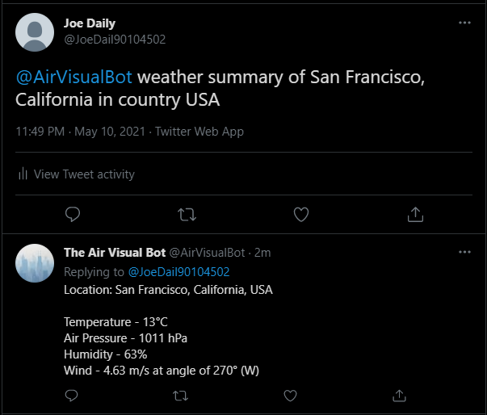

### Function 7: Pollution Summary with Specified Location

This function allows the user to query a current pollution summary pertaining to a specified city, state, and country. Note that the supported cities, states, and countries can be found using the first three functions above. The usability of this function is as follows:

 ```
 @AirVisualBot pollution summary of <<enter-city-here>>, <<enter-state-here>> in country <<enter-country-here>>
 ``` 

From there, the Bot retrieves the pollution information in that specified city from the AirVisual API using an according GET request to the following endpoint: http://api.airvisual.com/v2/city?city={{CITY}}&state={{STATE}}&{{COUNTRY}}=USA&key={{YOUR_API_KEY}}. Here is an example of this request in action for San Francisco, California in country USA:

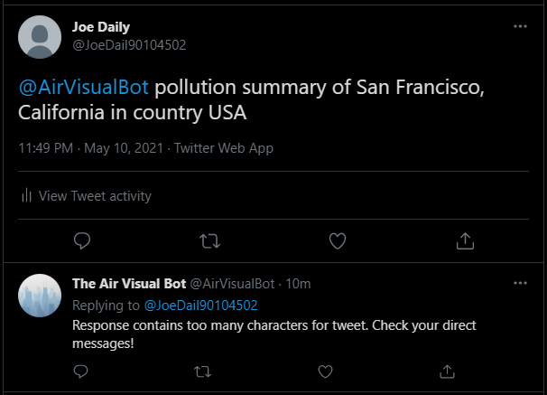

Here is the direct message the user received:

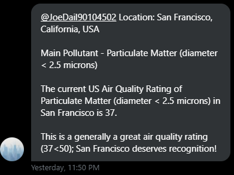

### Function 8: Temperature with GPS Coordinates

 This function allows the user to query the current temperature (in degrees Celsius) pertaining to a city that is supported and nearest the latitude and longitude GPS coordinates specified. The usability of this function is as follows:

 ```
 @AirVisualBot temperature of lat <<enter-lat-here>> and long <<enter-long-here>>
 ``` 

Please note that the latitude must be specified between -90 and 90 (inclusively), and the longitude must be specified between -180 and 180 (inclusively). From there, the Bot retrieves the current temperature in the city nearest to those coordinates from the AirVisual API using an according GET request to the following endpoint: http://api.airvisual.com/v2/nearest_city?lat={{LATITUDE}}&lon={{LONGITUDE}}&key={{YOUR_API_KEY}}. The Bot also generates a personalized message regarding the magnitude of the current temperature. Here is an example of this request in action for the longitude and latitude nearest to Lost Creek, Texas in the United States of America:

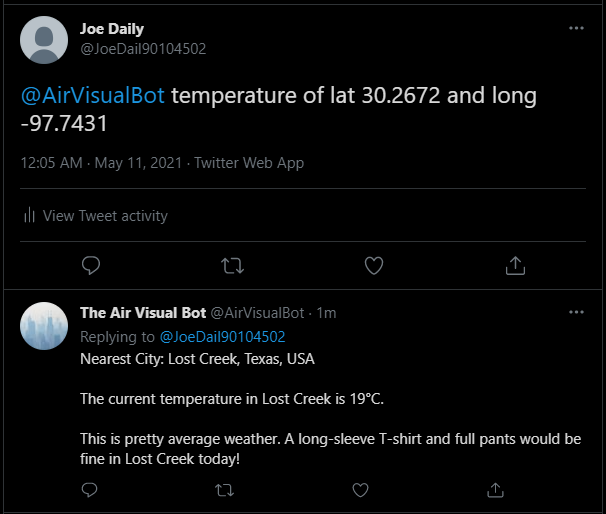

### Function 9: Temperature with Specified Location

This function allows the user to query the current temperature (in degrees Celsius) pertaining to a specified city, state, and country. Note that the supported cities, states, and countries can be found using the first three functions above. The usability of this function is as follows:

 ```
 @AirVisualBot temperature of <<enter-city-here>>, <<enter-state-here>> in country <<enter-country-here>>
 ``` 

From there, the Bot retrieves the current temperature in that specified city from the AirVisual API using an according GET request to the following endpoint: http://api.airvisual.com/v2/city?city={{CITY}}&state={{STATE}}&{{COUNTRY}}=USA&key={{YOUR_API_KEY}}. The Bot also generates a personalized message regarding the magnitude of the current temperature. Here is an example of this request in action for San Francisco, California in country USA:

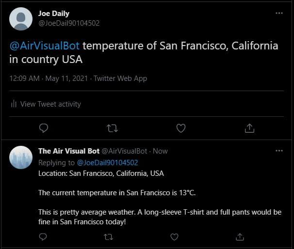

### Function 10: Air Pressure with GPS Coordinates

 This function allows the user to query the current air pressure (in hPa) pertaining to a city that is supported and nearest the latitude and longitude GPS coordinates specified. The usability of this function is as follows:

 ```
 @AirVisualBot pressure of lat <<enter-lat-here>> and long <<enter-long-here>>
 ``` 

Please note that the latitude must be specified between -90 and 90 (inclusively), and the longitude must be specified between -180 and 180 (inclusively). From there, the Bot retrieves the current air pressure in the city nearest to those coordinates from the AirVisual API using an according GET request to the following endpoint: http://api.airvisual.com/v2/nearest_city?lat={{LATITUDE}}&lon={{LONGITUDE}}&key={{YOUR_API_KEY}}. The Bot also generates a personalized message regarding the magnitude of the current air pressure. Here is an example of this request in action for the longitude and latitude nearest to Lost Creek, Texas in the United States of America:

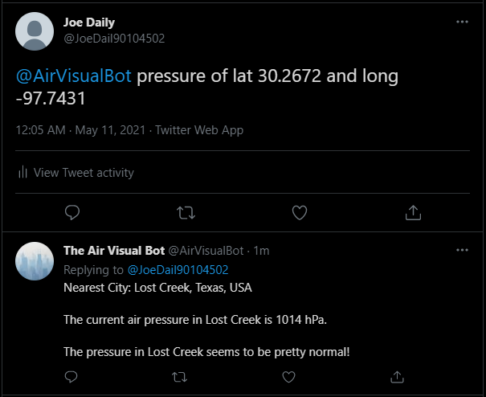

### Function 11: Air Pressure with Specified Location

This function allows the user to query the current air pressure (in hPa) pertaining to a specified city, state, and country. Note that the supported cities, states, and countries can be found using the first three functions above. The usability of this function is as follows:

 ```
 @AirVisualBot pressure of <<enter-city-here>>, <<enter-state-here>> in country <<enter-country-here>>
 ``` 

From there, the Bot retrieves the current air pressure in that specified city from the AirVisual API using an according GET request to the following endpoint: http://api.airvisual.com/v2/city?city={{CITY}}&state={{STATE}}&{{COUNTRY}}=USA&key={{YOUR_API_KEY}}. The Bot also generates a personalized message regarding the magnitude of the current air pressure. Here is an example of this request in action for San Francisco, California in country USA:

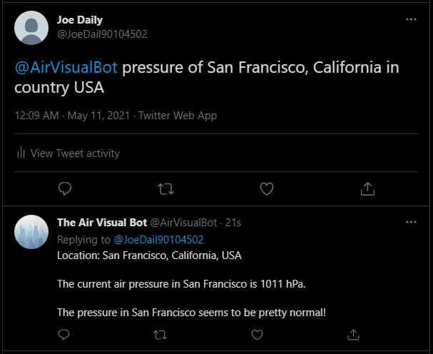

### Function 12: Humidity with GPS Coordinates

 This function allows the user to query the current humidity (%) pertaining to a city that is supported and nearest the latitude and longitude GPS coordinates specified. The usability of this function is as follows:

 ```
 @AirVisualBot humidity of lat <<enter-lat-here>> and long <<enter-long-here>>
 ``` 

Please note that the latitude must be specified between -90 and 90 (inclusively), and the longitude must be specified between -180 and 180 (inclusively). From there, the Bot retrieves the current humidity in the city nearest to those coordinates from the AirVisual API using an according GET request to the following endpoint: http://api.airvisual.com/v2/nearest_city?lat={{LATITUDE}}&lon={{LONGITUDE}}&key={{YOUR_API_KEY}}. The Bot also generates a personalized message regarding the magnitude of the current humidity. Here is an example of this request in action for the longitude and latitude nearest to Lost Creek, Texas in the United States of America:

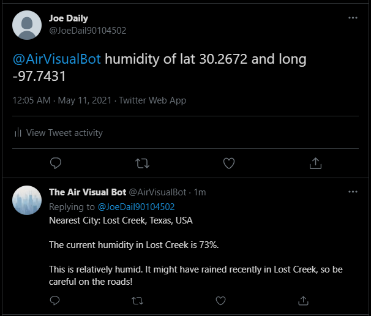

### Function 13: Humidity with Specified Location

This function allows the user to query the current humidity (%) pertaining to a specified city, state, and country. Note that the supported cities, states, and countries can be found using the first three functions above. The usability of this function is as follows:

 ```
 @AirVisualBot humidity of <<enter-city-here>>, <<enter-state-here>> in country <<enter-country-here>>
 ``` 

From there, the Bot retrieves the current humidity in that specified city from the AirVisual API using an according GET request to the following endpoint: http://api.airvisual.com/v2/city?city={{CITY}}&state={{STATE}}&{{COUNTRY}}=USA&key={{YOUR_API_KEY}}. The Bot also generates a personalized message regarding the magnitude of the current humidity. Here is an example of this request in action for San Francisco, California in country USA:

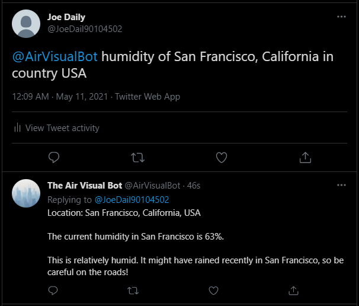

### Function 14: Wind Information with GPS Coordinates

 This function allows the user to query the current wind information (speed in m/s and direction in degrees) pertaining to a city that is supported and nearest the latitude and longitude GPS coordinates specified. The usability of this function is as follows:

 ```
 @AirVisualBot wind information of lat <<enter-lat-here>> and long <<enter-long-here>>
 ``` 

Please note that the latitude must be specified between -90 and 90 (inclusively), and the longitude must be specified between -180 and 180 (inclusively). From there, the Bot retrieves the current wind information in the city nearest to those coordinates from the AirVisual API using an according GET request to the following endpoint: http://api.airvisual.com/v2/nearest_city?lat={{LATITUDE}}&lon={{LONGITUDE}}&key={{YOUR_API_KEY}}. The Bot also generates a personalized message regarding the magnitude of the current wind speed, and also generates a cardinal direction based on the degree direction provided by the API. Here is an example of this request in action for the longitude and latitude nearest to Lost Creek, Texas in the United States of America:

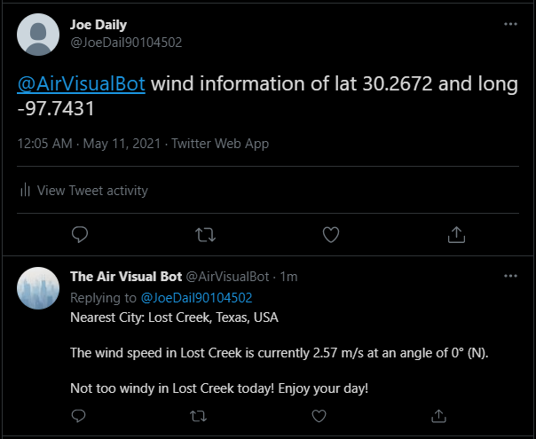

### Function 15: WInd Information with Specified Location

This function allows the user to query the current wind information (speed in m/s and direction in degrees) pertaining to a specified city, state, and country. Note that the supported cities, states, and countries can be found using the first three functions above. The usability of this function is as follows:

 ```
 @AirVisualBot wind information of <<enter-city-here>>, <<enter-state-here>> in country <<enter-country-here>>
 ``` 

From there, the Bot retrieves the current wind information in that specified city from the AirVisual API using an according GET request to the following endpoint: http://api.airvisual.com/v2/city?city={{CITY}}&state={{STATE}}&{{COUNTRY}}=USA&key={{YOUR_API_KEY}}. The Bot also generates a personalized message regarding the magnitude of the current wind speed, and also generates a cardinal direction based on the degree direction provided by the API. Here is an example of this request in action for San Francisco, California in country USA:

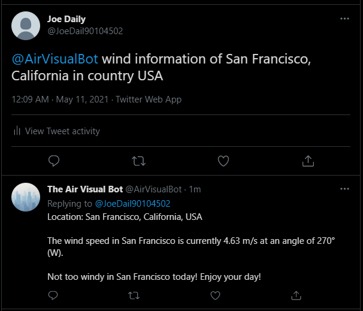

## Error Handling in Twitter

The Twitter Bot also supports error handling of two common cases:

- [Case 1: Bad HTTP Request](#case-1-bad-http-request)
- [Case 2: Unsupported Command](#case-2-unsupported-command)

### Case 1: Bad HTTP Request

The first common error case that the Twitter bot handles is a query resulting in a bad HTTP Request to the AirVisual API. Here is an example of this error handling in action:

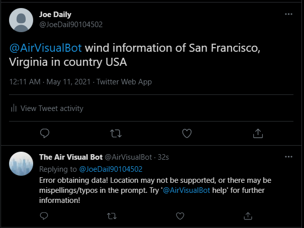

As seen in the above screenshot, the command is supported and follows the usability rules of Function #15 above. However, by looking closely at the state, we can see that the user meant 'California' yet instead entered 'Virginia'. As such, 'San Francisco, Virginia, in country USA' is not a supported city (and probably does not even exist). Thus, the Twitter Bot replies with an according tweet informing the user that this may be the reason their request was not handled correctly. The response also directs the user to try the help function in order to learn more information regarding usability of this application on Twitter.

### Case 2: Unsupported Command

The other common error case that the Twitter bot handles is a query that is unsupported by the usability of this application. Here is an example of this error handling in action:

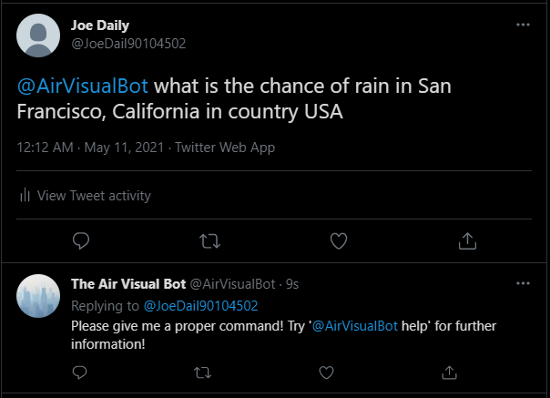

As seen in the above screenshot, the command is unsupported by the application; it doesn't follow the usability rules of Functions 0-15. The Twitter bot recognizes this and responds with an informative error message reminding the user to check the usability rules and supported commands of the application.

## Cloning Usability

The following section contains information on how to reproduce this application after cloning the repository from this GitHub endpoint.

### Pulling/Creating the Dockerfile

#### Pulling Directly from Dockerhub

One can pull this container directly from Docker Hub using the following command: 

```
docker pull kss7yy/sarnaik_airvisual_api_twitter_bot
```

However, this type of pulling is essentially useless since environment variables are required not only to authenticate to the Twitter account, but also the AirVisual API. These have been passed in to the AWS EC2 Instance and Docker container at runtime, so others do not have access to my sensitive information!

#### Manual Build and Creation

If one decides to reproduce this application, manual build and creation is much more fruitful, as it will allow the passing in of environment variables at runtime! After cloning the GitHub repository locally, cd into the directory, and run the following command:

```
docker build -t <image tag> .
```

### Running the Docker Container

In order to run the Docker Container successfully, one must be able to pass in environment variables at runtime. The proper command to run with these variables is as follows:

```
docker run -it -e CONSUMER_KEY="<<enter-twitter-consumer-key>>" \
 -e CONSUMER_SECRET="<<enter-twitter-consumer-secret-key>>" \
 -e ACCESS_TOKEN="<<enter-twitter-access-token>>" \
 -e ACCESS_TOKEN_SECRET="<<enter-twitter-secret-access-token>>" \
 -e AIRVISUAL_KEY="<<enter-airvisual-api-key>>" \
 kss7yy/sarnaik_airvisual_api_twitter_bot
```

With this run command, you can run the docker container with your own Twitter developer account and AirVisual API Key. The following links are extremely helpful to follow along with in order to generate the relevant API keys, understand the code/docker container, and also upload the container to AWS as I have done:

- AirVisual API Key Generation: https://www.iqair.com/us/air-pollution-data-api
- Twitter Developer Account Generation: https://developer.twitter.com/
- Real Python Twitter API Tutorial (with Dockerization and AWS Upload): https://realpython.com/twitter-bot-python-tweepy/

## Overview of Files and General Documentation

This section contains a general overview of the files included in this repository. Please refer to the files themselves for specific, inline comments to aid in understanding the application and code that runs it.

### bots directory

#### config.py

Contains the initial verification of Twitter credentials for the account that is being used to read/write tweets and direct messages.

#### sarnaik_bot.py

Contains the bulk of the code utilized to execute the application successfully. This is the script that is being continually run in the Docker Container in AWS.

#### api_tester.py

Utilized to test the API and functionality of the application locally (without twitter). Prompts the user for a query through use of the console and responds with the console as well (strictly input/output functionality).

### Dockerfile

Contains the instructions necessary to build the Docker container of this application. Utilizes the python:3.7-alpine base container and then moves relevant files into the docker container for build. Executes the sarnaik_bot.py script at runtime as default after installing the relevant Python modules and libraries in 'requirements.txt' using the pip3 Python installer.

### requirements.txt

Contains the Python modules and libraries necessary for the successful execution of this application. These are as follows: certifi, chardet, idna, oauthlib, Pysocks, requests, requests-oauthlib, six, tweepy, and urllib3.

### sarnaik_airvisual_api_twitter_bot.tar.gz

Encoded image of the Docker container utilized for uploading to AWS EC2 instance.

### venv directory

Python's default virtual environment created for initial testing of this application on local machine.

### images directory

Possesses the images utilized throughout this README.md file.

## End Notes

This project was programmed through use of Python3, Docker, AWS, Twitter, Twitter Developer API, and Github by Kunaal Sarnaik (kss7yy@virginia.edu). The assignment is Data Project #2 in the DS 3002: Data Science Systems Course at the University of Virginia, taught by professor Neal Magee, Ph.D. during the Spring 2021 semester. DS 3002 was taken for completion of the Data Science Minor at the University of Virginia.